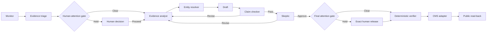

# Human-Governed Agent Publishing

A copyable multi-agent workflow for evidence-heavy publishing, with human-attention gates, adversarial review, exact-file verification, and a deterministic release check.

AI can help prepare a publication. Letting the same model research, write, approve, and publish its own work is less a workflow than an unattended group project.

This repository shows a safer division of labor.

## What this gives you

- Seven reusable agent prompts with distinct editorial jobs
- Risk-based model routes that reserve stronger models for consequential review
- Compact, role-specific context instead of one swollen prompt for every agent
- Deterministic preflight checks that stop doomed review calls before they incur API cost
- An append-only usage ledger with per-role cost estimates
- A two-stage gate that decides when a human must intervene
- Claim-check and adversarial-review records bound to exact file hashes
- A release verifier that fails closed when evidence, copy, policy, or approval changes
- A synthetic demonstration packet containing no real reporting data
- Standard-library Python with no runtime dependencies
- Tests for the failure cases that matter most

The template can support a local publication, research newsletter, policy brief series, nonprofit knowledge product, or another evidence-dependent editorial operation. It does not include a CMS publisher. Your publishing adapter should call the verifier immediately before it changes any external state.

## The operating idea

Agent judgment proposes. Deterministic code disposes.



The agents do the interpretive work. The verifier checks file hashes, review order, decision values, unresolved findings, source records, and any required human release. It cannot decide whether prose is fair or whether a source is credible. That remains editorial work.

## The seven roles

| Role | Job | Cannot do |
| --- | --- | --- |
| Monitor | Finds dated, in-scope developments | Draft or select the final angle |
| Facilitator | Applies the human-attention policy at discovery and final review | Research around a hold or impersonate the editor |
| Evidence Analyst | Builds the source packet and drafts from verified material | Manufacture support or hide uncertainty |
| Entity Resolver | Confirms names, roles, organizations, and links | Guess identities or infer sensitive facts |
| Claim Checker | Compares each factual claim with its evidence | Approve usefulness or authorize release |
| Digest Editor | Connects approved work into a periodic synthesis | Reintroduce held or rejected material |
| Skeptic | Challenges evidence, framing, fairness, and value | Override a human hold or publish |

The prompt files live in [`prompts/`](prompts/). Treat them as starting points. A useful adaptation replaces their generic scope with your editorial brief, evidence rules, source hierarchy, and named human authority.

## Cost controls without weaker gates

The sample routing policy spends less on repetitive discovery and entity cleanup, then reserves stronger reasoning for claim checking, adversarial review, and final human-attention decisions.

That hierarchy is deliberate. A cheap monitoring miss is recoverable. A cheap model waving through a weak allegation is rather more memorable.

The package also includes:

- shared context plus one small context file per role;
- a preflight command that verifies files and prerequisite reviews before an expensive agent runs;
- usage records that separate uncached input, cached input, cache writes, output, reasoning, and paid tool calls;
- a monthly cost report grouped by role.

```bash
agent-publish route monitor
agent-publish preflight /path/to/packet --stage skeptic
agent-publish cost-report usage/openai.jsonl --month 2026-09
```

The included routing configuration is an OpenAI example, not a provider requirement. Prices change. Update them from the linked provider source before treating estimates as current. See [`docs/cost-controls.md`](docs/cost-controls.md) for adapter examples and quality guardrails.

## Why two human-attention checks?

The first check happens after evidence triage. It prevents an autonomous system from running far with a sensitive, ambiguous, or unusually consequential topic.

The second happens after claim checking and adversarial review. A harmless-looking lead can develop into a legally sensitive claim. A routine assignment can also reveal a genuinely surprising finding that deserves the editor’s judgment before release.

The default trigger set is:

- **Approval:** The action is risky, irreversible, externally directed, or outside standing authority.
- **Expertise:** The interpretation depends on knowledge the agents do not possess.
- **Variance:** Several defensible angles would materially change the argument, or the draft has fallen into a conventional machine framing.
- **Interest:** Evidence reveals a surprising connection, hidden consequence, new mechanism, or unusually consequential choice.

A hold applies to the affected item. Other low-risk work can continue. Silence never becomes consent.

## Quick start

Requires Python 3.11 or newer.

```bash
python -m venv .venv
source .venv/bin/activate
python -m pip install -e .
python -m unittest discover -s tests -v
agent-publish demo /tmp/agent-publishing-demo
agent-publish preflight /tmp/agent-publishing-demo --stage skeptic --allow-demo
agent-publish verify /tmp/agent-publishing-demo --allow-demo
```

The demonstration uses a clearly labeled fictional publication, organization, person, and source document. The verifier refuses demo packets unless `--allow-demo` is supplied.

## What the verifier checks

The release gate in [`src/human_agent_publishing/gate.py`](src/human_agent_publishing/gate.py) requires:

1. The exact artifact, metadata, policy, source registry, and entity registry.
2. Evidence files whose current hashes match their source records.
3. A Claim Checker `PASS` with at least one supported finding and no unresolved issues.
4. A later Skeptic `APPROVE` with no blockers or requested rework.
5. A still-later final Facilitator record tied to the same package.
6. Either an autonomous decision with no triggers or a direct human `PUBLISH` decision bound to the held package.
7. Prompt and runtime manifests whose hashes have not changed since review.
8. A packet free of symlinks and credential-bearing filenames.

Any changed byte breaks the corresponding approval. Fix the package, then review it again. Do not “repair” a stale approval by editing its hash field. That is paperwork cosplay.

## What this repository deliberately does not do

- Call a model provider
- Scrape private sources
- Store API keys
- Contact sources
- Decide that a source is trustworthy
- Sign human decisions cryptographically
- Publish to WordPress, Ghost, Substack, email, or social media
- Claim that multiple agents are independent when they share the same model and context

Those boundaries are features. They keep the reusable core small and make external actions visible.

## Adapting it

Start with [`docs/adaptation-guide.md`](docs/adaptation-guide.md). The short version:

1. Write a concrete editorial brief.
2. Define approved sources and evidence labels.
3. Edit the seven prompts.
4. Tune model routes against your own quality tests and current provider prices.
5. Replace the example policy with your actual authority limits.
6. Store human decisions in a location the scheduled workflow cannot write.
7. Add a CMS adapter that calls `verify_packet()` immediately before release.
8. Read the published result back from a public endpoint.

The architecture review in [`docs/design-review.md`](docs/design-review.md) explains which safeguards carry the most weight and where this pattern still depends on human and operational controls.

## License

[MIT](LICENSE)
